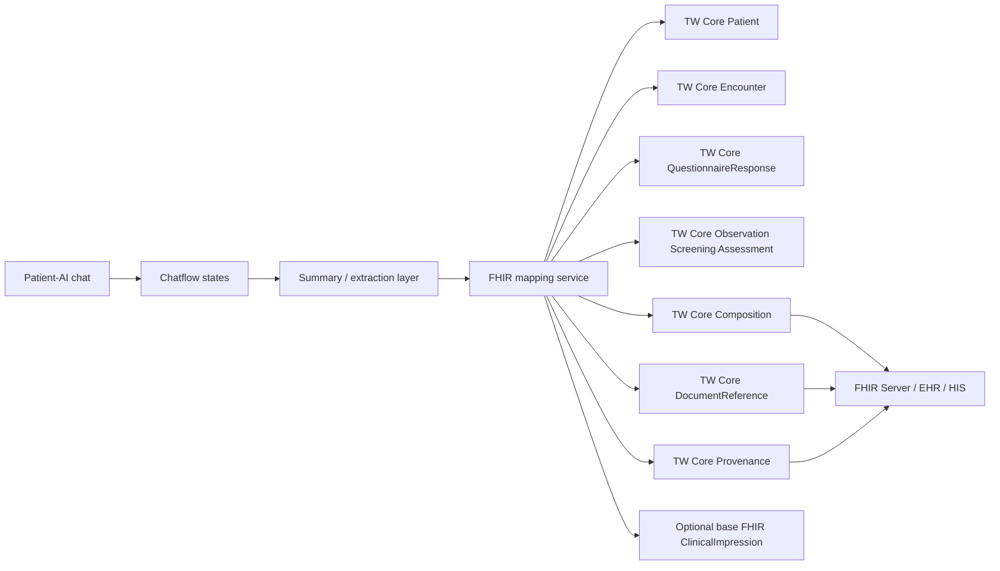

# AI Companion 與 FHIR / TW Core 實際整合說明

## 文件目的
這份文件說明目前這個 AI Companion 軟體，實際上要怎麼接到 FHIR，並在台灣情境下對應到 TW Core。

它回答 5 個實作上最重要的問題：
- 這個產品最後要輸出什麼 FHIR 資源
- 哪些部分應優先對到 TW Core，哪些只能先用 base FHIR
- 目前 chatflow 裡的 state 怎麼映射到 Resource
- 後端真的要送資料時，建議的 API / bundle 形狀是什麼
- 哪些地方現在可以做，哪些地方還需要後端、UI、授權流程才能完成

---

## 先講結論

### 這個軟體不應直接把整段聊天當成一個 FHIR Resource
比較合理的做法是把它拆成 4 層：

1. 對話層  
病人與 AI 的原始互動。

2. 結構化萃取層  
也就是目前 chatflow 裡的：
- `latest_tag_payload`
- `red_flag_payload`
- `hamd_progress_state`
- `summary_draft_state`
- `clinician_summary_draft`
- `patient_review_packet`
- `patient_authorization_state`
- `fhir_delivery_draft`
- `delivery_readiness_state`

3. FHIR 映射層  
把上述狀態轉成可交換的 FHIR / TW Core 資源。

4. 交付層  
把資源送到：
- FHIR Server
- 醫療院所 EHR / HIS
- 病人審閱 UI
- 醫師端摘要檢視 UI

換句話說，現在 chatflow 已經把第 2 層做出來，第 3 層也有 draft，但真正上線還需要後端把 draft 變成正式 FHIR 資源並送出。

---

## 採用的標準基礎

### FHIR 版本
TW Core IG v1.0.0 是建立在 FHIR R4.0.1 之上，而不是 R5。這點在 TW Core 官方說明頁有直接寫明。  
來源：
- [TW Core IG 應用說明](https://twcore.mohw.gov.tw/ig/twcore/index.html)

### TW Core 的角色
TW Core 不是另外一套獨立標準，而是「台灣在 FHIR R4.0.1 上定義的實作指引與 Profile 集」。  
它規範的重點是：
- 要用哪些 Resource
- 哪些欄位必填 / 必須支援
- 代碼綁定與查詢方式
- 在台灣場景下怎麼交換比較一致

來源：
- [TW Core IG v1.0.0 首頁](https://twcore.mohw.gov.tw/ig/twcore/index.html)
- [TW Core IG ImplementationGuide](https://twcore.mohw.gov.tw/ig/twcore/1.0.0/ImplementationGuide-tw.gov.mohw.twcore.html)

---

## 這個產品建議輸出的 FHIR / TW Core Resource

### 1. Patient
用途：
- 對應病人主體
- 作為幾乎所有資源的 `subject`

建議使用：
- `TW Core Patient`

原因：
- QuestionnaireResponse、Observation、Composition、Encounter 都會指到病人
- TW Core 已有對 Patient 的台灣化 Profile

來源：
- [TW Core Patient](https://twcore.mohw.gov.tw/ig/twcore/1.0.0/StructureDefinition-Patient-twcore.html)

### 2. Encounter
用途：
- 表示這次 AI Companion session 所屬的就醫或互動情境
- 讓同一次聊天、問卷、摘要、觀察資料可被綁在同一個臨床事件上

建議使用：
- `TW Core Encounter`

來源：
- [TW Core Encounter](https://twcore.mohw.gov.tw/ig/twcore/StructureDefinition-Encounter-twcore.html)

### 3. QuestionnaireResponse
用途：
- 表示病人於對話過程中被蒐集到的問答結果
- 特別適合承接「量表 / 半量表 / AI 引導式問答」的原始答案結構

建議使用：
- `TW Core QuestionnaireResponse`

為什麼很適合這個產品：
- 目前系統雖然不像硬式量表，但其實有持續累積可映射到量表的內容
- TW Core QuestionnaireResponse 已要求 `subject` 指向 `TW Core Patient`
- 也可帶 `encounter`、`authored`、`author`

來源：
- [TW Core QuestionnaireResponse](https://twcore.mohw.gov.tw/ig/twcore/1.0.0/StructureDefinition-QuestionnaireResponse-twcore.html)
- [FHIR R4 QuestionnaireResponse](https://www.hl7.org/fhir/R4/questionnaireresponse.html)

### 4. Observation
用途：
- 表示從對話萃取出的症狀、篩檢、量表線索、風險線索
- 比 QuestionnaireResponse 更適合放「已抽取、可被臨床使用的觀察結果」

這個產品最關鍵的 Observation 類型有兩種：

#### 4-1. TW Core Observation Screening Assessment
適合放：
- 憂鬱線索
- 情緒 / 睡眠 / 功能受損 / 焦慮等篩檢評估結果
- 由 AI 自然對話累積出的量表導向訊號

為什麼重要：
- TW Core 對這個 profile 已定義 `category=survey` 的查詢與支援方式
- 很適合裝本產品的「HAM-D 線索」和之後的 PHQ-9 / GAD-7 類型衍生資料

來源：
- [TW Core Observation Screening Assessment](https://twcore.mohw.gov.tw/ig/twcore/1.0.0/StructureDefinition-Observation-screening-assessment-twcore.html)

#### 4-2. TW Core Simple Observation 或 Observation Clinical Result
適合放：
- 某些不一定是正式量表題，但已能穩定抽取的單點觀察
- 例如：
  - 睡著後易醒
  - 工作效率下降
  - 明顯自責

來源：
- [TW Core Simple Observation](https://twcore.mohw.gov.tw/ig/twcore/1.0.0/StructureDefinition-Observation-simple-twcore.html)
- [TW Core Observation Clinical Result](https://twcore.mohw.gov.tw/ig/twcore/StructureDefinition-Observation-clinical-result-twcore.html)

### 5. Composition
用途：
- 把整份診前摘要整成一份臨床文件
- 這是最適合承接 `clinician_summary_draft` 的資源

建議使用：
- `TW Core Composition`

為什麼：
- `clinician_summary_draft` 本質上不是單一 observation，而是一份臨床摘要文件
- 例如可切 sections：
  - chief concerns
  - symptom summary
  - risk
  - follow-up needs
  - HAM-D signals

來源：
- [TW Core Composition](https://twcore.mohw.gov.tw/ig/twcore/StructureDefinition-Composition-twcore.html)

### 6. DocumentReference
用途：
- 當你不只想存結構化欄位，還想保留一份可下載 / 可檢視的摘要文件版本時使用
- 例如：
  - 醫師摘要 PDF
  - 病人審閱版文件
  - 已簽核版本的 document artifact

建議使用：
- `TW Core DocumentReference`

來源：
- [TW Core DocumentReference](https://twcore.mohw.gov.tw/ig/twcore/StructureDefinition-DocumentReference-twcore.html)

### 7. Provenance
用途：
- 記錄這份摘要是怎麼來的
- 誰產生、誰審閱、哪些是 AI 推定、哪些是病人確認

這對本產品非常重要，因為它不是傳統人工填表系統，而是：
- AI 生成
- 病人審閱
- 最後才交付

建議使用：
- `TW Core Provenance`

來源：
- [TW Core Provenance](https://twcore.mohw.gov.tw/ig/twcore/1.0.0/StructureDefinition-Provenance-twcore-definitions.html)

### 8. ClinicalImpression
用途：
- 放「綜合臨床評估印象」
- 很適合承接 risk/context 的綜合判斷

注意：
- FHIR R4 有 `ClinicalImpression`
- 目前 TW Core 1.0.0 主軸中，這個產品比較能穩定對到的仍是 `Composition + Observation + QuestionnaireResponse + Provenance`
- `ClinicalImpression` 可以保留為 base FHIR 或專案自訂層使用

來源：
- [FHIR R4 ClinicalImpression](https://www.hl7.org/fhir/R4/clinicalimpression.html)

---

## 這個 AI Companion 的 state 要怎麼映射

### `latest_tag_payload`
建議用途：
- 不直接單獨交付
- 作為 Observation 與 Composition 的中介材料

映射方向：
- `warning_tags` -> Observation / ClinicalImpression / Composition.safety section
- `sentiment_tags`、`behavioral_tags`、`cognitive_tags` -> Observation candidates

### `red_flag_payload`
建議用途：
- 轉成：
  - Observation Screening Assessment
  - ClinicalImpression
  - Composition 的 risk section

如果未來要做更正式風險流程：
- 可再加 `Flag` 或 `DetectedIssue`
但這不在目前 chatflow 範圍內。

### `hamd_progress_state`
建議用途：
- 最適合轉成：
  - QuestionnaireResponse
  - Observation Screening Assessment

實務上建議：
- 原始「對話萃取出的題意 / 線索」先進 `QuestionnaireResponse`
- AI 推定的症狀與維度摘要進 `Observation`

### `clinician_summary_draft`
建議用途：
- 核心映射到 `Composition`
- 若需要檔案型態再補 `DocumentReference`

### `patient_review_packet`
建議用途：
- 不直接當臨床最終文件
- 較像病人端 UI state
- 可在後端保留，但不一定要直接送 FHIR server

### `patient_authorization_state`
建議用途：
- 不建議直接塞成 Observation
- 比較像 consent / workflow 狀態

實務選擇：
- 若有正式電子授權流程，之後可映射到 `Consent`
- 在目前階段先當 app-internal workflow state 最合理

### `fhir_delivery_draft`
建議用途：
- 不是最終 Resource
- 是 server-side mapping plan

### `delivery_readiness_state`
建議用途：
- 不建議直接交給外部 FHIR server
- 應作為後端 workflow gating 狀態

---

## 建議的實際交付架構

### 最佳做法
不要讓 Dify chatflow 直接呼叫 FHIR Server。  
建議讓 chatflow 只產生結構化 state，然後由後端 `FHIR mapping service` 負責：
- 驗證欄位
- 補齊 Patient / Encounter / author references
- 轉成正式 Resource JSON
- 做 Bundle transaction
- 寫入 FHIR Server

---

## 建議的最小可行 Bundle

如果你要做第一版 MVP，我會建議最小交付包包含：

1. `Patient`
2. `Encounter`
3. `QuestionnaireResponse`
4. `Observation` x N
5. `Composition`
6. `Provenance`

`DocumentReference` 可第二階段再加。  
`ClinicalImpression` 可視院方需求再加。

---

## 這個產品最合理的 FHIR 映射分工

### 病人主體
- `TW Core Patient`

### 本次 AI session
- `TW Core Encounter`

### 原始問答 / 量表型內容
- `TW Core QuestionnaireResponse`

### AI 萃取出的症狀 / 線索
- `TW Core Observation Screening Assessment`
- `TW Core Simple Observation`

### 給醫師看的摘要
- `TW Core Composition`

### 摘要檔案版本
- `TW Core DocumentReference`

### 來源與審閱歷程
- `TW Core Provenance`

### 綜合印象
- base `ClinicalImpression`

---

## 這個產品跟 TW Core 的實際連結點

### 可以直接對上的
- `Patient`
- `Encounter`
- `QuestionnaireResponse`
- `Observation Screening Assessment`
- `Composition`
- `DocumentReference`
- `Provenance`

### 需要專案自訂轉譯的
- `patient_review_packet`
- `patient_authorization_state`
- `delivery_readiness_state`

原因很簡單：
這三個本質上是產品 workflow state，不是標準臨床觀察值。

### 需要小心不要直接亂塞的
- 不能把整段聊天全文直接塞成單一 Observation
- 不能把 AI 推定與病人確認混在同一欄不標 provenance
- 不能在病人未審閱 / 未同意前，就把 AI 草稿當 final clinical document

---

## 建議的系統實作責任切分

### Chatflow
負責：
- 對話
- 風險分流
- 結構化萃取
- 摘要草稿

### Backend API
負責：
- 建立 / 查找 Patient
- 建立 Encounter
- 驗證病人授權狀態
- 將 draft state 轉成正式 FHIR JSON
- 打包 Bundle
- 寫入 FHIR Server

### FHIR Mapping Layer
負責：
- `clinician_summary_draft -> Composition`
- `hamd_progress_state -> QuestionnaireResponse / Observation`
- `red_flag_payload -> Observation / Composition risk section`
- `patient_authorization_state -> Consent gating logic`
- `delivery_readiness_state -> export workflow control`

### UI
負責：
- 顯示病人審閱包
- 讓病人修改 / 刪除 / 同意
- 顯示醫師端摘要

---

## 上線前一定要補的 4 件事

### 1. 病人授權不能只存在 chatflow state
現在的 `patient_authorization_state` 只是結構化草稿。  
真正上線時，要有：
- UI 勾選 / 確認
- 時間戳
- 誰同意
- 同意範圍

### 2. AI 推定與病人確認要分開
這點非常重要。  
否則醫師看到內容時，不知道哪一段是：
- 病人原意
- AI 摘要
- AI 推定

這就是為什麼 `Provenance` 很重要。

### 3. 量表映射要有版本控制
例如：
- 今天是 HAM-D 7 維簡化線索
- 明天可能變成 PHQ-9 / GAD-7 / C-SSRS 混合版

Questionnaire canonical、item linkId、Observation code 都要版本化。

### 4. 不能只存文件，還要能查結構化欄位
如果只存 PDF 或文字摘要，後面很難做：
- 風險追蹤
- 症狀變化比較
- 儀表板
- 條件查詢

所以 `Composition + Observation + QuestionnaireResponse + Provenance` 這套是必要的。

---

## 目前這個 repo 的成熟度判讀

如果用 FHIR / TW Core readiness 來看，現在大概是：

### 已有
- chatflow 可產生結構化中介 state
- 有病人審閱包草稿
- 有醫師摘要草稿
- 有 FHIR 映射 draft
- 有 delivery readiness state

### 尚未完成
- 真正的 Patient / Encounter 建立流程
- 正式 Resource JSON builder
- FHIR transaction Bundle
- TW Core profile validation
- Consent / Provenance 真正落地
- 寫入 FHIR Server 的 API

所以目前比較準確的說法是：

這個產品已經完成「FHIR / TW Core 前的結構化準備層」，但還沒有完成真正的 FHIR exchange layer。

---

## 推薦的下一步

如果要往真的 FHIR / TW Core 交付走，我建議順序是：

1. 先定義 internal JSON contract  
也就是把：
- `clinician_summary_draft`
- `hamd_progress_state`
- `red_flag_payload`
- `patient_authorization_state`

固定成穩定 schema。

2. 建一個 mapping service  
把 internal JSON 轉成：
- `Patient`
- `Encounter`
- `QuestionnaireResponse`
- `Observation`
- `Composition`
- `Provenance`

3. 用 TW Core 1.0.0 驗證  
先驗：
- `TW Core Patient`
- `TW Core QuestionnaireResponse`
- `TW Core Observation Screening Assessment`
- `TW Core Composition`

4. 最後才接 FHIR Server  
不要反過來。

---

## 參考資料
- [TW Core IG v1.0.0 首頁](https://twcore.mohw.gov.tw/ig/twcore/index.html)
- [TW Core Patient](https://twcore.mohw.gov.tw/ig/twcore/1.0.0/StructureDefinition-Patient-twcore.html)
- [TW Core Encounter](https://twcore.mohw.gov.tw/ig/twcore/StructureDefinition-Encounter-twcore.html)
- [TW Core QuestionnaireResponse](https://twcore.mohw.gov.tw/ig/twcore/1.0.0/StructureDefinition-QuestionnaireResponse-twcore.html)
- [TW Core Observation Screening Assessment](https://twcore.mohw.gov.tw/ig/twcore/1.0.0/StructureDefinition-Observation-screening-assessment-twcore.html)
- [TW Core Composition](https://twcore.mohw.gov.tw/ig/twcore/StructureDefinition-Composition-twcore.html)
- [TW Core DocumentReference](https://twcore.mohw.gov.tw/ig/twcore/StructureDefinition-DocumentReference-twcore.html)
- [TW Core Provenance](https://twcore.mohw.gov.tw/ig/twcore/1.0.0/StructureDefinition-Provenance-twcore-definitions.html)
- [FHIR R4 QuestionnaireResponse](https://www.hl7.org/fhir/R4/questionnaireresponse.html)
- [FHIR R4 ClinicalImpression](https://www.hl7.org/fhir/R4/clinicalimpression.html)
